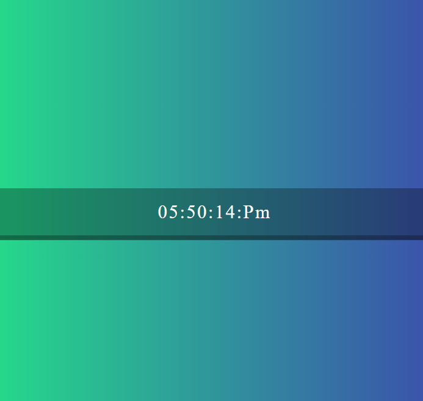

# ⏰ Automatic Digital Clock

A simple **JavaScript digital clock** that displays the current time in real-time.  
The clock updates automatically every second and shows hours, minutes, seconds, and AM/PM format.

---

## 📌 Overview
This project is a real-time digital clock built using **HTML, CSS, and JavaScript**.  
It dynamically updates the time using JavaScript's `Date` object and `setInterval()` function.

---

## ✨ Features
- ⏱️ Real-time clock updates every second  
- 🕐 12-hour format (AM/PM)  
- 🔢 Leading zeros for clean display  
- 🎨 Custom styling using CSS  
- ⚡ Lightweight and beginner-friendly  

---

## 🖼️ Screenshot

> Save your screenshot inside: